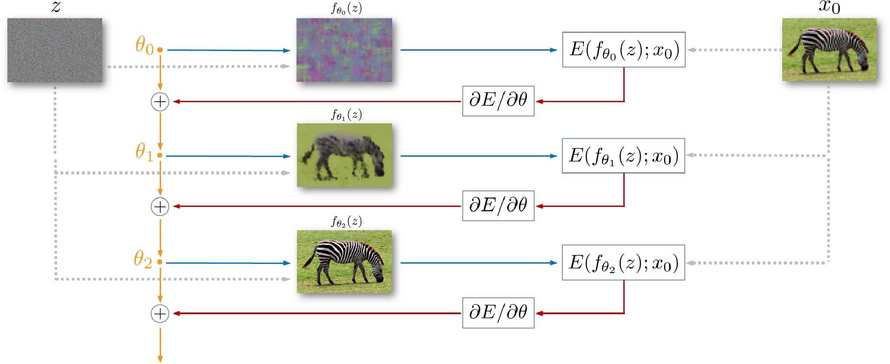
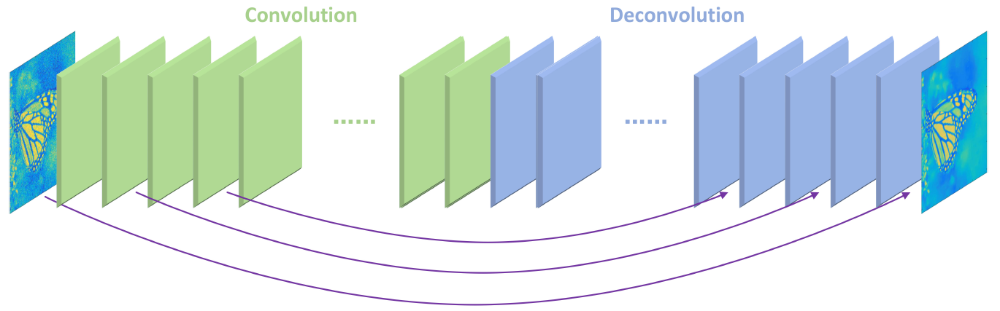
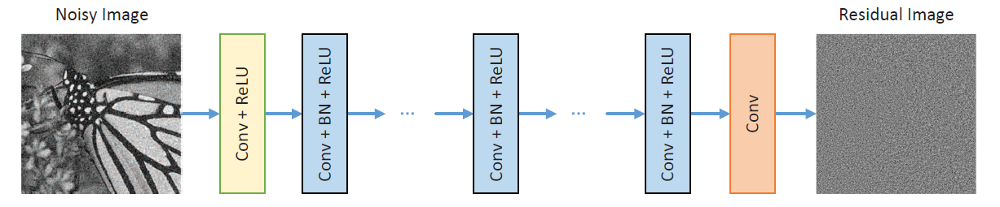

## This is the repository of the final project for the Machine Learning 2022 course in Skoltech.

In this project results of the article [“Deep learning in denoising of micro-computed tomography images of rock samples”](https://doi.org/10.1016/j.cageo.2021.104716) are reproduced. Two approaches to remove the noise from CT rock images are utilised: supervised model RedNET, and self-supervised model DIP. 

## Requirements

```bash
pip install -r requirements.txt
```
## How to use

RedNET model need to be configured with YAML files, that are located in the [configs folder](https://github.com/Volodimirich/DL-in-denoising-MCT-rock-images/tree/main/configs).

After applying configuration, `train.sh` file needs to be executed.
If you want check quality of your results you can use `inference.sh` with the specified path to the model weights. Also you should change model type in the `inference.py` file, because the `.py` file DnCNN is set as a basic model.

DIP model and following instructions are located in [this folder](https://github.com/Volodimirich/DL-in-denoising-MCT-rock-images/tree/main/DIP).

Images denoised with DIP were used to train RedNET as the target. Different loss functions were used to evaluate the supervised model and obtain best denoising performance.

`Deep Image Prior Model`


`RedNET Model`


As improvements to the original article, new spectral residual-based loss SR-SIM and DnCNN achitecture are proposed. 

`DnCNN Model`



## Sources
https://github.com/smikhai1/deep-image-denoising

https://github.com/DmitryUlyanov/deep-image-prior

https://github.com/SaoYan/DnCNN-PyTorch

## License
MIT

## Contact
Vladimir.Shaposhnikov@skoltech.ru

Dmitry.Artemasov@skoltech.ru

Sergey.Kupriyanov@skoltech.ru

Dmitrii.Masnyi@skoltech.ru
